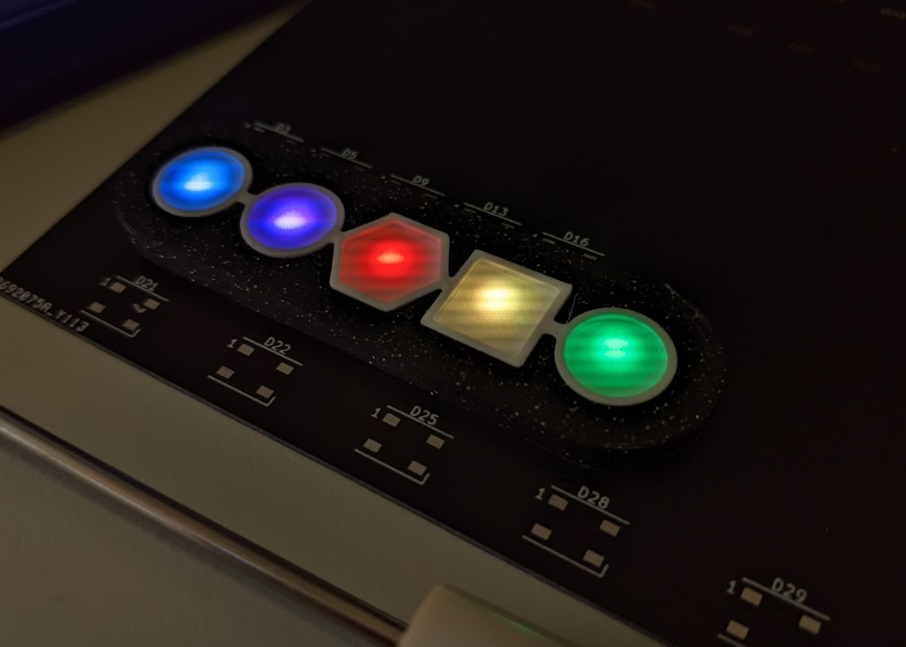

## WORK IN PROGRESS

The schematic is about 80% done.

Multiple boards were produced to test:
  - how touchpad shapes affect the capacitance in order to detect the touch
  - different types of LEDs which emit light through PCB and 3D printed objects
  - how PCB mask affects the emitted light through PCB

Results of tests are shown in Images folder. Images unfortunately can't show the actual LED light effect.

